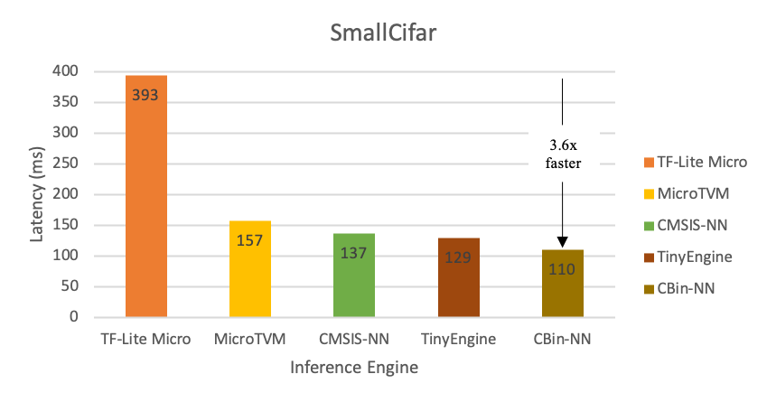
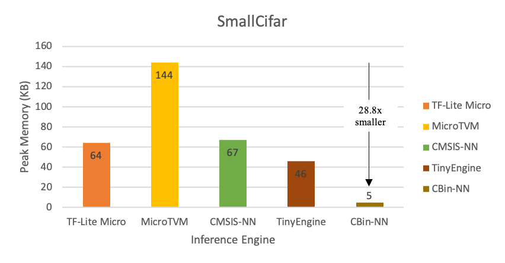

# CBin-NN Inference Engine

**CBin-NN** is an open-source framework for running Binarized Neural Networks (BNNs) on resource-constrained devices, such as Microcontroller Units (MCUs).

## Hybrid Packaging (Python + C)

CBin-NN is now structured as both a Python package for model conversion and a C package for device-side inference.

### 1. Python Package (Converter)

Install the CBin-NN converter tools:

```bash
pip install .
```

This provides the `cbin-convert` command:

```bash
cbin-convert weights/lenet_PReLU.h5 models/
```

### 2. C Package (Inference Library)

Build the automated test and see the library build:

```bash
make run
```

Or build the static library specifically to use in your own projects:

```bash
make lib
# Output: build/libcbinnn.a
```

## Quick Start

```bash
# Clean, convert, compile and run in one go
make run
```

## Project Structure

*   `cbin_nn/`: Python package root.
    *   `operators/`: Core CBin-NN C source code and headers.
    *   `model_converter.py`: Model conversion logic.
*   `models/`: Output directory for generated C model files.
*   `weights/`: Directory containing pre-trained Keras models.
*   `main.c`: Example entry point for running inference on a PC.
*   `Makefile`: Automated build script for both executable and library.

## Manual C Compilation

To link manually against the library:

```bash
gcc main.c -Lbuild -lcbinnn -I cbin_nn/operators -I models -lm -o my_app
```

## Prerequisites

*   **Python 3.9+**
*   **TensorFlow**, **Larq**, **NumPy**
*   **GCC** or other standard C compiler

## Performance & Results

Below are benchmark results demonstrating the efficiency and output of the CBin-NN engine:




## Support or Contact

For more information, see our [IEEE EDGE 2022 paper](https://scholar.google.com/citations?view_op=view_citation&hl=en&user=x3TEgPQAAAAJ&citation_for_view=x3TEgPQAAAAJ:qjMakFHDy7sC).
